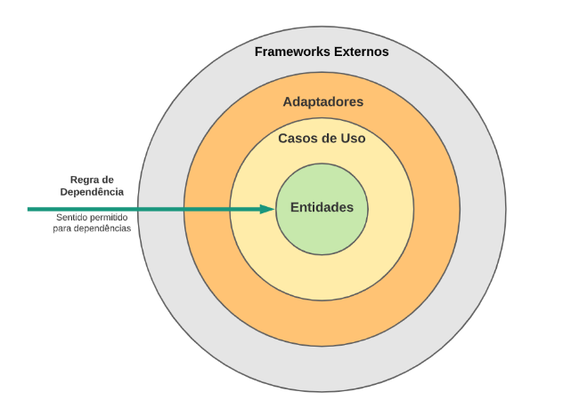

# Trabalho 1 - Engenharia de Software

# Roteiro Prático - Clean Architecture com TypeScript e Node.js

### Alunos:

- Lara Gama Santos
- Lucas Santos Rodrigues
- Marcela Camarano Caram Peito
- Vinicius Ferreira Pinheiro

## O que é Clean Architecture?
  Clean Architecture é uma arquitetura de software que tem por objetivo padronizar e organizar o código desenvolvido, favorecendo a sua reusabilidade e a independência de tecnologia. Dessa forma, a lógica de negócios é encapsulada e separada do mecanismo de entrega. Entre algumas vantagens da Clean Architecture estão:

- Facilita a realização de testes
- Permite independência da interface do usuário
- Permite independência do banco de dados
- Permite independência de agentes externos, como Frameworks

  A Clean Architecture promove a separação de responsabilidades em um sistema, dividindo-o em várias camadas ou níveis, conforme pode ser observado na imagem abaixo. Dentre as camadas representadas estão: entidades (classes comuns a vários sistemas), casos de uso (regras de negócio específicas do sistema), adaptadores (viabilizam a comunicação entre as camadas internas e a camada externa) e frameworks externos (bibliotecas, frameworks e sistemas externos).

<div align="center">
    
</div>

## Como fazer uma Clean Architecture com TypeScript e Node.js?
  Ao combinar os princípios da Clean Architecture com as capacidades de tipagem estática do TypeScript e a versatilidade do ambiente de execução do Node.js, os desenvolvedores podem criar aplicativos escaláveis e de alta qualidade. Essa abordagem pode ser feita por meio do cumprimento dos seguintes tópicos chaves:

- `Entidades`: Defina objetos de negócios centrais, como 'Usuário', 'Produto', 'Pedido', etc.
- `Casos de Uso` (Use Cases): Desenvolva métodos principais, como 'Criar Usuário', 'Atualizar Produto', 'Processar Pedido', etc.
- `Interfaces de Controlador`: Crie interfaces de controlador para traduzir solicitações HTTP em chamadas de casos de uso, como 'UserController', 'ProductController', etc.
- `Camada de Aplicativo`: Implemente a lógica intermediária que coordena interações entre entidades e casos de uso.
- `Camada de Infraestrutura`: Gerencie conexões com bibliotecas externas, bancos de dados e serviços de terceiros, como repositórios e adaptadores de banco de dados.

## Instalação das ferramentas
  Para este tutorial, será necessária a instalação do Node.js e do Typescript.

#### Instalação do Node.js
```shellscript
curl -sL https://deb.nodesource.com/setup\_13.x | sudo -E bash -
```  
```shellscript
sudo apt install nodejs
``` 
#### Verificando a versão instalada
```shellscript
node --version
```

#### Iniciando uma aplicação
```shellscript
mkdir nodeapp 
```

```shellscript
cd nodeapp  
``` 

```shellscript
npm init
```

### Instalação do Typescript
  Após a instalação do NodeJs vamos criar um projeto chamado **ts** e aplicar o comando no terminal dentro do diretório do projeto
```shellscript
npm init
```
Este comando criará o arquivo **package.json**, que será útil posteriormente. Aperte enter para pular todas as perguntas que surgirão após o comando.

#### Para instalar o TypeScript, basta aplicar o comando:
```shellscript
npm install typescript
```
  Perceba que o arquivo **package.json** já exibe o pacote do TypeScript como dependência.
  Agora vamos iniciar as configurações do TypeScript. Primeiro, aplique o comando:

```shellscript
npx tsc --init
```
Este comando irá gerar o arquivo **tsconfig.json**, que será responsável pelas configurações do TypeScript.
Neste arquivo, devemos alterar o parâmetro **"modules": "commonjs"** para **"modules": "ESNext"**, aqui estamos avisando ao TypeScript para usar o padrão do EcmaScript mais atual. Também vamos deixar ativado o parâmetro **"outDir": "./dist"**, que será o diretório onde o TypeScript irá gerar o código JavaScript, lembrando que o TypeScript gera um código JavaScript.

### Criando primeiro código em TypeScript
  Para testar a instalação acima, vamos criar um arquivo teste.ts na raiz de nosso projeto com seguinte código:
```typescript
let idade: number = 20;
let nome: string = 'Vinicius';

console.log(`nome: ${nome}, idade: ${idade}`);
```
  TypeScript nesse momento, a ideia neste exemplo é verificar se nosso ambiente está ok, para isso vamos executar o seguinte comando:
```shellscript
npx tsc
```
  Podemos testar e executar o código JavaScript gerado, vamos usar o comando:
```shellscript
node ./dist/teste.js
```
Caso esteja correto, o resultado do comando acima deve ser:
```shellscript
nome: Vinicius, idade: 20
```
### Criando um código Clean Architecture com TypeScript e Node.js
  Primeiramente, vamos criar um novo projeto Node.js e inicializar o npm:
  
```bash
mkdir clean-architecture-demo
cd clean-architecture-demo
npm init -y
```

#### Instalando Dependências

Depois, instale as dependências necessárias (Inversify, inversify-express-utils e Express):

```bash
npm install inversify inversify-express-utils express reflect-metadata
npm install @types/express --save-dev
```

####  Configurando o TypeScript

Crie um arquivo `tsconfig.json` na raiz do projeto e adicione as seguintes configurações:

```json
{
  "compilerOptions": {
    "target": "es6",
    "module": "commonjs",
    "outDir": "dist",
    "strict": true,
    "esModuleInterop": true,
    "experimentalDecorators": true,
    "emitDecoratorMetadata": true
  }
}
```

####  Implementando as Camadas da Clean Architecture

#####  - Entidades

Crie uma pasta chamada `entities` e adicione um arquivo `User.ts`:

```typescript
export class User {
  constructor(public id: number, public name: string, public email: string) {}
}
```

##### - Casos de Uso

Crie uma pasta chamada `useCases` e adicione um arquivo `UserUseCase.ts`:

```typescript
import { injectable } from "inversify";
import { User } from "../entities/User";

@injectable()
export class UserUseCase {
  getUsers(): User[] {
    // Dados simulados para fins de demonstração
    return [
      new User(1, "John Doe", "john@example.com"),
      new User(2, "Jane Smith", "jane@example.com"),
    ];
  }
}
```

##### - Controladores

Crie uma pasta chamada `controllers` e adicione um arquivo `UserController.ts`:

```typescript
import { Request, Response } from "express";
import { controller, httpGet } from "inversify-express-utils";
import { UserUseCase } from "../useCases/UserUseCase";
import { inject } from "inversify";

@controller("/users")
export class UserController {
  constructor(@inject(UserUseCase) private userUseCase: UserUseCase) {}

  @httpGet("/")
  async getUsers(_: Request, res: Response) {
    const users = this.userUseCase.getUsers();
    return res.json(users);
  }
}
```

#### Configurando o Contêiner Inversify

Crie um arquivo chamado `inversify.config.ts`:

```typescript
import { Container } from "inversify";
import { UserController } from "./controllers/UserController";
import { UserUseCase } from "./useCases/UserUseCase";

const container = new Container();
container.bind<UserController>(UserController).toSelf();
container.bind<UserUseCase>(UserUseCase).toSelf();

export default container;
```

#### Configurando o Servidor Express

Crie um arquivo chamado `app.ts`:

```typescript
import "reflect-metadata";
import { InversifyExpressServer } from "inversify-express-utils";
import container from "./inversify.config";

const server = new InversifyExpressServer(container);

server.build().listen(3000, () => {
  console.log("Servidor iniciado em http://localhost:3000");
});
```


